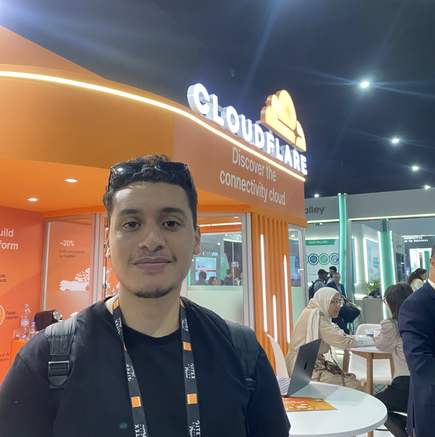

  

<h1 align="center">Anass</h1>

  

  Research-oriented developer focusing my studies on Artificial Intelligence, Data Science, and Big Data technologies.

  <a href="https://github.com/kurapikanlight">GitHub</a> ·
  <a href="mailto:contact.kafeyn@gmail.com">Email</a>

## About

My interests include **AI development, full-stack development, application development, and Linux**. I enjoy building practical tools while continuing to explore machine learning and research.

## Featured Work

### [Docker-Goo](https://github.com/kurapikanlight/docker-goo)

A Linux-first interface for managing Docker containers and related resources, inspired by the familiar workflow of Docker Desktop.

`Rust` · `Linux` · `Docker`

### [ASUS GPU Switcher](https://github.com/kurapikanlight/asus-gpu-switcher)

A Linux-oriented tool for switching GPU modes on supported ASUS laptops.

`Linux` · `GPU management`

## Other Work

- **Smart Arrow Tiling** — a GNOME extension for keyboard-driven window tiling.
- **Deep Learning Models of Zellige** — computer vision work on detecting and classifying zellige motifs.
- **Remindee** — an Android app for reminders and goals.

## Languages & Technologies

**Python** · **C / C++** · **Flutter / Dart** · **Kotlin** · **Rust**

**Linux** · **Docker** · **Git**